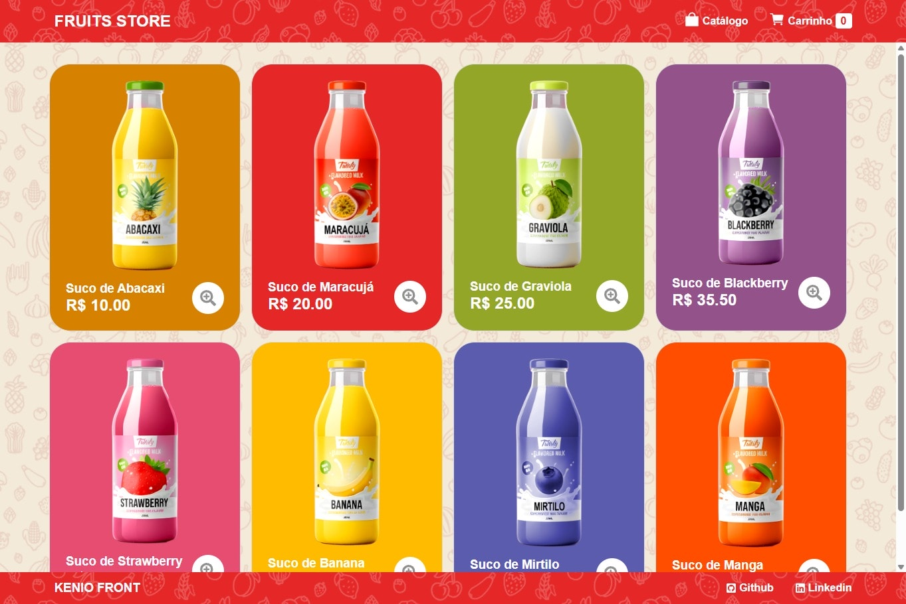

# 🛒 Mini Shop Cart

> Aplicação de catálogo de produtos focada em sucos, permitindo explorar itens disponíveis, visualizar detalhes e gerenciar um carrinho de compras de forma simples e intuitiva.

[](https://keniofront.github.io/mini-shop-cart/)



## 📋 Sobre o Projeto

Projeto pessoal desenvolvido como prática de React, com foco em gerenciamento de estado, componentização e armazenamento local. A aplicação simula um mini e-commerce, oferecendo uma experiência completa de navegação entre catálogo, página de detalhes e carrinho.
É totalmente responsiva e pensada para divulgação em portfólio, demonstrando habilidades em desenvolvimento front-end moderno.

## 🚀 Tecnologias Utilizadas

- **React** - Biblioteca para construção da interface
- **Vite** - Ferramenta de build e desenvolvimento
- **pnpm** - Gerenciador de pacotes

## ⚡ Principais Features

- Catálogo de produtos com informações de preço e botão de detalhes
- Página de detalhes com descrição estendida e opção de escolher quantidade
- Carrinho interativo para adicionar, remover e atualizar produtos
- Cálculo automático de valores totais e quantidades
- Persistência de dados no `localStorage`
- Interface responsiva para diferentes tamanhos de tela

## 🔧 Como Executar

```bash
# Clone o repositório
git clone https://github.com/keniofront/mini-todo-react.git

# Acesse o diretório
cd mini-todo-react

# Instale as dependências
pnpm install

# Execute o projeto
pnpm run dev
```

## 📱 Compatibilidade

- ✅ **Responsivo**: Desktop, Tablet, Mobile
- ✅ **Browsers**: Chrome, Firefox, Safari, Edge
- ✅ **API**: OMDb API (https://www.omdbapi.com/)

## 💡 Aprendizados

- Gerenciamento de estado em React utilizando Context API
- Armazenamento e persistência de dados no navegador (`localStorage`)
- Estruturação de componentes reutilizáveis
- Boas práticas de responsividade e usabilidade

## 🎯 Objetivo

Este projeto foi desenvolvido para demonstrar competências técnicas em:

- Criação de aplicações React modernas
- Implementação de lógica de carrinho de compras
- Consumo e manipulação de dados locais
- Desenvolvimento de interfaces funcionais e responsivas
- Aplicação de boas práticas em projetos front-end

## 🤝 Contribuição

Este é um projeto de portfólio, mas sugestões e feedbacks são sempre bem-vindos! Entre em contato para discussões técnicas ou oportunidades profissionais.

## 📞 Contato

- **LinkedIn**: https://www.linkedin.com/in/keniofront/
- **Email**: keniofront@gmail.com

---

**Desenvolvido com 💙 para fins educacionais e demonstração de habilidades técnicas.**
